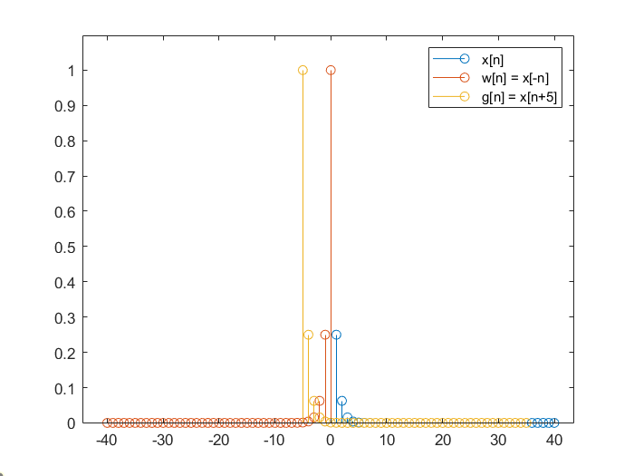

# Linear_Systems_Concepts_with_Matlab
This repository concentrates Matlab codes applied to the Linear Systems classes.

### Work 01 :

$$x[n] = x[n] = (1/4)^n u[n]$$ 
, where u[n] is the unit step function.
